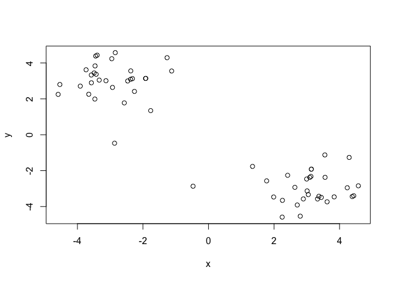
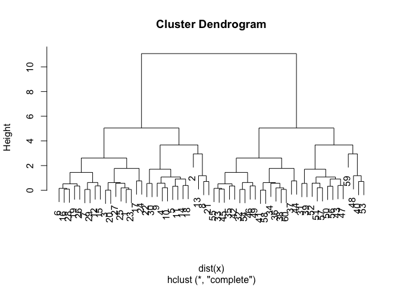
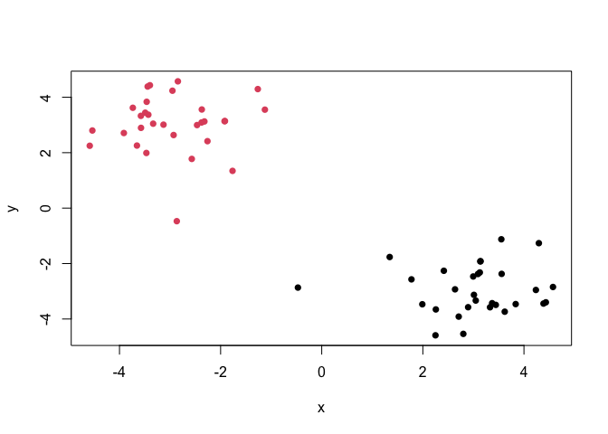

# class07: Machine learning 1
Trinity Lee A16639698

\#clustering

We will start today’s lab with clustering methods, in particular
so-called K-means. The main function for this is in R is `kmeans()`.

Lets try it on some made up data where we know what the answer should
be.

``` r
x<-rnorm(10000,mean=3)
hist(x)
```


60 points We can pass the function to `plot()`

``` r
tmp<-c(rnorm(30,mean=3),rnorm(30,-3))
x<-cbind(x=tmp,y=rev(tmp))
x
```

                  x         y
     [1,]  4.567590 -2.537230
     [2,]  4.071663 -3.536329
     [3,]  2.722591 -3.824499
     [4,]  3.204751 -2.628806
     [5,]  2.726415 -3.221223
     [6,]  2.687082 -3.061388
     [7,]  3.633563 -3.381992
     [8,]  3.104290 -1.980256
     [9,]  3.142553 -4.103406
    [10,]  4.532381 -4.984615
    [11,]  2.696153 -4.272246
    [12,]  3.209620 -3.296864
    [13,]  2.068790 -3.738992
    [14,]  3.143259 -2.983509
    [15,]  3.989590 -2.897700
    [16,]  2.380852 -5.003223
    [17,]  2.562640 -4.215971
    [18,]  4.203010 -3.391692
    [19,]  2.324392 -3.290412
    [20,]  2.164884 -4.448671
    [21,]  4.308692 -3.683166
    [22,]  4.325228 -3.319407
    [23,]  2.662087 -3.047884
    [24,]  1.414846 -4.954630
    [25,]  2.325128 -3.154322
    [26,]  2.647269 -3.362030
    [27,]  3.670753 -3.519915
    [28,]  3.227670 -4.477963
    [29,]  2.487040 -2.169228
    [30,]  2.657857 -2.577326
    [31,] -2.577326  2.657857
    [32,] -2.169228  2.487040
    [33,] -4.477963  3.227670
    [34,] -3.519915  3.670753
    [35,] -3.362030  2.647269
    [36,] -3.154322  2.325128
    [37,] -4.954630  1.414846
    [38,] -3.047884  2.662087
    [39,] -3.319407  4.325228
    [40,] -3.683166  4.308692
    [41,] -4.448671  2.164884
    [42,] -3.290412  2.324392
    [43,] -3.391692  4.203010
    [44,] -4.215971  2.562640
    [45,] -5.003223  2.380852
    [46,] -2.897700  3.989590
    [47,] -2.983509  3.143259
    [48,] -3.738992  2.068790
    [49,] -3.296864  3.209620
    [50,] -4.272246  2.696153
    [51,] -4.984615  4.532381
    [52,] -4.103406  3.142553
    [53,] -1.980256  3.104290
    [54,] -3.381992  3.633563
    [55,] -3.061388  2.687082
    [56,] -3.221223  2.726415
    [57,] -2.628806  3.204751
    [58,] -3.824499  2.722591
    [59,] -3.536329  4.071663
    [60,] -2.537230  4.567590

``` r
head(x)
```

                x         y
    [1,] 4.567590 -2.537230
    [2,] 4.071663 -3.536329
    [3,] 2.722591 -3.824499
    [4,] 3.204751 -2.628806
    [5,] 2.726415 -3.221223
    [6,] 2.687082 -3.061388

``` r
plot(x)
```



``` r
k<-kmeans(x,centers=2,nstart=20)
k
```

    K-means clustering with 2 clusters of sizes 30, 30

    Cluster means:
              x         y
    1  3.095421 -3.502163
    2 -3.502163  3.095421

    Clustering vector:
     [1] 1 1 1 1 1 1 1 1 1 1 1 1 1 1 1 1 1 1 1 1 1 1 1 1 1 1 1 1 1 1 2 2 2 2 2 2 2 2
    [39] 2 2 2 2 2 2 2 2 2 2 2 2 2 2 2 2 2 2 2 2 2 2

    Within cluster sum of squares by cluster:
    [1] 37.25218 37.25218
     (between_SS / total_SS =  94.6 %)

    Available components:

    [1] "cluster"      "centers"      "totss"        "withinss"     "tot.withinss"
    [6] "betweenss"    "size"         "iter"         "ifault"      

Q1. How many points are in each cluster?

``` r
k$size
```

    [1] 30 30

Q2. CLuster membership?

``` r
k$cluster
```

     [1] 1 1 1 1 1 1 1 1 1 1 1 1 1 1 1 1 1 1 1 1 1 1 1 1 1 1 1 1 1 1 2 2 2 2 2 2 2 2
    [39] 2 2 2 2 2 2 2 2 2 2 2 2 2 2 2 2 2 2 2 2 2 2

Q3. CLuster centers?

``` r
k$centers
```

              x         y
    1  3.095421 -3.502163
    2 -3.502163  3.095421

Q4. plot my clustering results.

``` r
plot(x, col=k$cluster,pch=16)
```


Q5. cluster the data again with `kmeans()` into 4 groups and plot the
results.

``` r
k4<-kmeans(x,centers=4,nstart=20)
plot(x, col=k4$cluster,pch=16)
```


k-means is popular mostly because it is fast and relatively
straightforward to run and understand. It has a big limitation in that
you need to tell it how many groups (k, or centers) you want.

\#Hierarchial clustering the main fucntion in base R is called
`hclust()`. You have to pass it in a “distance matrix” nto just your
input data.

You can generate a distance matrix with the `dist()` fucntion.

``` r
hc<-hclust(dist(x))
hc
```


    Call:
    hclust(d = dist(x))

    Cluster method   : complete 
    Distance         : euclidean 
    Number of objects: 60 

``` r
plot(hc)
```



To find clusters (cluster membership vector) from a `hclust()` reuslt we
can “cut” the tree at a certain height that we like.

``` r
grps<-cutree(hc,h=8)
plot(x, col=grps,pch=16)
abline(h=8,col="red")
```



``` r
table(grps)
```

    grps
     1  2 
    30 30 

\#Principal component analysis

\##PCA of UK food data Read data showing the comsumption of food in
grams (per person, per week) of 17 different types of food-stuff
measured and averaged in the four countries of the United Kingdom in
1997.

``` r
url <- "https://tinyurl.com/UK-foods"
x <- read.csv(url)
x
```

                         X England Wales Scotland N.Ireland
    1               Cheese     105   103      103        66
    2        Carcass_meat      245   227      242       267
    3          Other_meat      685   803      750       586
    4                 Fish     147   160      122        93
    5       Fats_and_oils      193   235      184       209
    6               Sugars     156   175      147       139
    7      Fresh_potatoes      720   874      566      1033
    8           Fresh_Veg      253   265      171       143
    9           Other_Veg      488   570      418       355
    10 Processed_potatoes      198   203      220       187
    11      Processed_Veg      360   365      337       334
    12        Fresh_fruit     1102  1137      957       674
    13            Cereals     1472  1582     1462      1494
    14           Beverages      57    73       53        47
    15        Soft_drinks     1374  1256     1572      1506
    16   Alcoholic_drinks      375   475      458       135
    17      Confectionery       54    64       62        41

Q1. How many rows and columns are in your new data frame named x? What R
functions could you use to answer this questions?

``` r
ans<-dim(x)
ans
```

    [1] 17  5

## Preview the first 6 rows

``` r
head(x)
```

                   X England Wales Scotland N.Ireland
    1         Cheese     105   103      103        66
    2  Carcass_meat      245   227      242       267
    3    Other_meat      685   803      750       586
    4           Fish     147   160      122        93
    5 Fats_and_oils      193   235      184       209
    6         Sugars     156   175      147       139

The row names seem to be incorrect with X as the first one. Let’s try to
fix this and get the correct amount of rows.

``` r
# Note how the minus indexing works
rownames(x) <- x[,1]
x <- x[,-1]
head(x)
```

                   England Wales Scotland N.Ireland
    Cheese             105   103      103        66
    Carcass_meat       245   227      242       267
    Other_meat         685   803      750       586
    Fish               147   160      122        93
    Fats_and_oils      193   235      184       209
    Sugars             156   175      147       139

``` r
ans1<-dim(x)
ans1
```

    [1] 17  4

To fix the issue we have when rerunning the data file again we will use
`read.csv()`

``` r
url <- "https://tinyurl.com/UK-foods"
x <- read.csv(url, row.names=1)
head(x)
```

                   England Wales Scotland N.Ireland
    Cheese             105   103      103        66
    Carcass_meat       245   227      242       267
    Other_meat         685   803      750       586
    Fish               147   160      122        93
    Fats_and_oils      193   235      184       209
    Sugars             156   175      147       139

Q2. Which approach to solving the ‘row-names problem’ mentioned above do
you prefer and why? Is one approach more robust than another under
certain circumstances?

I prefer using the row.names argument set to read.csv() due to it fixing
the issue while allowing us to rerun the data without messing it up.
Therefore it is more robust and less prone to error.

\#Spotting major differences and trends A cursory glance over the
numbers in this table does not reveal much of anything. Indeed in
general it is difficult to extract meaning in regard to major
differences and trends from any given array of numbers. Generating
regular bar-plots and various pairwise plots does not help too much
either

``` r
barplot(as.matrix(x), beside=T, col=rainbow(nrow(x)))
```


Q3: Changing what optional argument in the above barplot() function
results in the following plot?

``` r
barplot(as.matrix(x), beside=F, col=rainbow(nrow(x)))
```


Q5: Generating all pairwise plots may help somewhat. Can you make sense
of the following code and resulting figure? What does it mean if a given
point lies on the diagonal for a given plot?

``` r
pairs(x, col=rainbow(10), pch=16)
```


The figure shows graphs of the comparison of the amounts of each food
consumed by two countries. If a point lies on the diagonal for a graph
it means that exactly the same amount or similar amounts of that food
are consumed in the two countires being compared. Q6. What is the main
differences between N. Ireland and the other countries of the UK in
terms of this data-set?

There seems to be two major food categories that are different or
deviate from the diagonal between N.IReland and other UK countries but
we cannot determine which ones exactly from just looking at the graph.

\##PCA

PCA can help us make sense of these types of datasets. Let’s see how it
works.

The main function in “base R” is called `prcomp()`. In this case we want
to first take the transpose of our input `x` so the columns are the food
types and the countries are the rows.

``` r
head(t(x))
```

              Cheese Carcass_meat  Other_meat  Fish Fats_and_oils  Sugars
    England      105           245         685  147            193    156
    Wales        103           227         803  160            235    175
    Scotland     103           242         750  122            184    147
    N.Ireland     66           267         586   93            209    139
              Fresh_potatoes  Fresh_Veg  Other_Veg  Processed_potatoes 
    England               720        253        488                 198
    Wales                 874        265        570                 203
    Scotland              566        171        418                 220
    N.Ireland            1033        143        355                 187
              Processed_Veg  Fresh_fruit  Cereals  Beverages Soft_drinks 
    England              360         1102     1472        57         1374
    Wales                365         1137     1582        73         1256
    Scotland             337          957     1462        53         1572
    N.Ireland            334          674     1494        47         1506
              Alcoholic_drinks  Confectionery 
    England                 375             54
    Wales                   475             64
    Scotland                458             62
    N.Ireland               135             41

``` r
pca<-prcomp(t(x))
summary(pca)
```

    Importance of components:
                                PC1      PC2      PC3       PC4
    Standard deviation     324.1502 212.7478 73.87622 3.176e-14
    Proportion of Variance   0.6744   0.2905  0.03503 0.000e+00
    Cumulative Proportion    0.6744   0.9650  1.00000 1.000e+00

Q7. Complete the code below to generate a plot of PC1 vs PC2. The second
line adds text labels over the data points.

``` r
# Plot PC1 vs PC2
plot(pca$x[,1], pca$x[,2], xlab="PC1", ylab="PC2", xlim=c(-270,500))
text(pca$x[,1], pca$x[,2], colnames(x))
```


Q8. Customize your plot so that the colors of the country names match
the colors in our UK and Ireland map and table at start of this
document.

``` r
plot(pca$x[,1], pca$x[,2], col=c("orange","red","blue","green"),pch=16,xlab="PC1", ylab="PC2", xlim=c(-270,500))
text(pca$x[,1], pca$x[,2], colnames(x))
```


The “loadings” tell us how much of the original variables -foods
contribute to the new variables -PCs

``` r
head(pca$rotation)
```

                            PC1         PC2         PC3          PC4
    Cheese         -0.056955380  0.01601285  0.02394295 -0.694538519
    Carcass_meat    0.047927628  0.01391582  0.06367111  0.489884628
    Other_meat     -0.258916658 -0.01533114 -0.55384854  0.279023718
    Fish           -0.084414983 -0.05075495  0.03906481 -0.008483145
    Fats_and_oils  -0.005193623 -0.09538866 -0.12522257  0.076097502
    Sugars         -0.037620983 -0.04302170 -0.03605745  0.034101334

we can use the square of pca\$sdev , which stands for “standard
deviation”, to calculate how much variation in the original data each PC
accounts for.

``` r
v <- round( pca$sdev^2/sum(pca$sdev^2) * 100 )
v
```

    [1] 67 29  4  0

``` r
## or the second row here...
z <- summary(pca)
z$importance
```

                                 PC1       PC2      PC3          PC4
    Standard deviation     324.15019 212.74780 73.87622 3.175833e-14
    Proportion of Variance   0.67444   0.29052  0.03503 0.000000e+00
    Cumulative Proportion    0.67444   0.96497  1.00000 1.000000e+00

This information can be summarized in a plot of the variances
(eigenvalues) with respect to the principal component number
(eigenvector number), which is given below.

``` r
barplot(v, xlab="Principal Component", ylab="Percent Variation")
```


\#Digging deeper We can also consider the influence of each of the
original variables upon the principal components (typically known as
loading scores). This information can be obtained from the `prcomp()`
returned `$rotation` component. It can also be summarized with a call to
`biplot()`

``` r
## Lets focus on PC1 as it accounts for > 90% of variance 
par(mar=c(10, 3, 0.35, 0))
barplot( pca$rotation[,1], las=2 )
```


Q9: Generate a similar ‘loadings plot’ for PC2. What two food groups
feature prominantely and what does PC2 maninly tell us about?

``` r
par(mar=c(10, 3, 0.35, 0))
barplot( pca$rotation[,2], las=2 )
```


The two food groups are fresh potatoes and soft drinks. PC2 mainly tells
us about the left over varience that PC1 does not cover.
