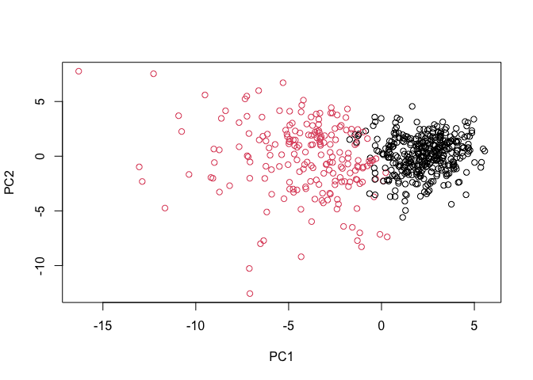

# class 08 Mini-project
Trinity Lee A16639698

\##Outline Today we will explore a complete analysis using the
unsupervised learning techniques covered in class. We’ll extend what
you’ve learned by combining PCA as a preprocessing step to clustering
using data that consist of measurements of cell nuclei of human breast
masses \##Data input Data is supplied on a CSV format: \# Save your
input data file into your Project directory and store as wisc.df

``` r
fna.data<-"WisconsinCancer.csv"
wisc.df<-read.csv(fna.data,row.names=1)
```

We do not want to be able to see the pathologist provided diagnosis as
it is essentially our “answer” to the question of which cell smamples
are cancerous. \# We can use -1 here to remove the first column

``` r
wisc.data <- wisc.df[,-1]
```

# Create diagnosis vector for later

``` r
diagnosis<-as.factor(wisc.df$diagnosis)
```

Q1. How many observations are in this dataset?

``` r
ans1<-nrow(wisc.df)
ans1
```

    [1] 569

Q2. How many of the observations have a malignant diagnosis?

``` r
table(wisc.df$diagnosis)
```


      B   M 
    357 212 

``` r
ans2<-212
ans2
```

    [1] 212

Q3. How many variables/features in the data are suffixed with \_mean?

``` r
# Get the column names of the data frame
column_names <- names(wisc.df)
# Use grep to count the variables with "_mean" suffix
count_means <- sum(grepl("_mean$", column_names))
# Print 
count_means
```

    [1] 10

``` r
# Check column means and standard deviations
colMeans(wisc.data)
```

                radius_mean            texture_mean          perimeter_mean 
               1.412729e+01            1.928965e+01            9.196903e+01 
                  area_mean         smoothness_mean        compactness_mean 
               6.548891e+02            9.636028e-02            1.043410e-01 
             concavity_mean     concave.points_mean           symmetry_mean 
               8.879932e-02            4.891915e-02            1.811619e-01 
     fractal_dimension_mean               radius_se              texture_se 
               6.279761e-02            4.051721e-01            1.216853e+00 
               perimeter_se                 area_se           smoothness_se 
               2.866059e+00            4.033708e+01            7.040979e-03 
             compactness_se            concavity_se       concave.points_se 
               2.547814e-02            3.189372e-02            1.179614e-02 
                symmetry_se    fractal_dimension_se            radius_worst 
               2.054230e-02            3.794904e-03            1.626919e+01 
              texture_worst         perimeter_worst              area_worst 
               2.567722e+01            1.072612e+02            8.805831e+02 
           smoothness_worst       compactness_worst         concavity_worst 
               1.323686e-01            2.542650e-01            2.721885e-01 
       concave.points_worst          symmetry_worst fractal_dimension_worst 
               1.146062e-01            2.900756e-01            8.394582e-02 

``` r
apply(wisc.data,2,sd)
```

                radius_mean            texture_mean          perimeter_mean 
               3.524049e+00            4.301036e+00            2.429898e+01 
                  area_mean         smoothness_mean        compactness_mean 
               3.519141e+02            1.406413e-02            5.281276e-02 
             concavity_mean     concave.points_mean           symmetry_mean 
               7.971981e-02            3.880284e-02            2.741428e-02 
     fractal_dimension_mean               radius_se              texture_se 
               7.060363e-03            2.773127e-01            5.516484e-01 
               perimeter_se                 area_se           smoothness_se 
               2.021855e+00            4.549101e+01            3.002518e-03 
             compactness_se            concavity_se       concave.points_se 
               1.790818e-02            3.018606e-02            6.170285e-03 
                symmetry_se    fractal_dimension_se            radius_worst 
               8.266372e-03            2.646071e-03            4.833242e+00 
              texture_worst         perimeter_worst              area_worst 
               6.146258e+00            3.360254e+01            5.693570e+02 
           smoothness_worst       compactness_worst         concavity_worst 
               2.283243e-02            1.573365e-01            2.086243e-01 
       concave.points_worst          symmetry_worst fractal_dimension_worst 
               6.573234e-02            6.186747e-02            1.806127e-02 

We need to scale our input data before PCA as some of the columns are
measures in terms of very different units with different means and
variances. To do this here we set `scale=TRUE` argument to `prcomp()`.

``` r
# Perform PCA on wisc.data by completing the following code
wisc.pr <- prcomp(wisc.data,scale=TRUE)
#look at summary of results
summary(wisc.pr)
```

    Importance of components:
                              PC1    PC2     PC3     PC4     PC5     PC6     PC7
    Standard deviation     3.6444 2.3857 1.67867 1.40735 1.28403 1.09880 0.82172
    Proportion of Variance 0.4427 0.1897 0.09393 0.06602 0.05496 0.04025 0.02251
    Cumulative Proportion  0.4427 0.6324 0.72636 0.79239 0.84734 0.88759 0.91010
                               PC8    PC9    PC10   PC11    PC12    PC13    PC14
    Standard deviation     0.69037 0.6457 0.59219 0.5421 0.51104 0.49128 0.39624
    Proportion of Variance 0.01589 0.0139 0.01169 0.0098 0.00871 0.00805 0.00523
    Cumulative Proportion  0.92598 0.9399 0.95157 0.9614 0.97007 0.97812 0.98335
                              PC15    PC16    PC17    PC18    PC19    PC20   PC21
    Standard deviation     0.30681 0.28260 0.24372 0.22939 0.22244 0.17652 0.1731
    Proportion of Variance 0.00314 0.00266 0.00198 0.00175 0.00165 0.00104 0.0010
    Cumulative Proportion  0.98649 0.98915 0.99113 0.99288 0.99453 0.99557 0.9966
                              PC22    PC23   PC24    PC25    PC26    PC27    PC28
    Standard deviation     0.16565 0.15602 0.1344 0.12442 0.09043 0.08307 0.03987
    Proportion of Variance 0.00091 0.00081 0.0006 0.00052 0.00027 0.00023 0.00005
    Cumulative Proportion  0.99749 0.99830 0.9989 0.99942 0.99969 0.99992 0.99997
                              PC29    PC30
    Standard deviation     0.02736 0.01153
    Proportion of Variance 0.00002 0.00000
    Cumulative Proportion  1.00000 1.00000

Q4. From your results, what proportion of the original variance is
captured by the first principal components (PC1)?

``` r
0.4427
```

    [1] 0.4427

Q5. How many principal components (PCs) are required to describe at
least 70% of the original variance in the data?

``` r
3
```

    [1] 3

Q6. How many principal components (PCs) are required to describe at
least 90% of the original variance in the data? 7 Let’s create a biplot
of the `wisc.pr` using the `biplot()` function.

``` r
biplot(wisc.pr)
```


Q7. What stands out to you about this plot? Is it easy or difficult to
understand? Why? The plot is very messy and hard to understand due to
all the points compacted and names squeezed into a small space. Too many
things are going on for the plot to be understood and no data can be
read effectively.

lets generate a more standard scatter plot of each observation along
principal components 1 and 2 and color the points by the diagnosis \#
Scatter plot observations by components 1 and 2

``` r
plot( wisc.pr$x[,1:2] , col = diagnosis, 
     xlab = "PC1", ylab = "PC2")
```


Q8. Generate a similar plot for principal components 1 and 3. What do
you notice about these plots?

``` r
# Repeat for components 1 and 3
plot(wisc.pr$x[,1:3 ], col = diagnosis, 
     xlab = "PC1", ylab = "PC3")
```


The colors indicating the diagnosis are clumped together (red and
black).However, the second plot has more variance shown then the first
which is indicated by a more clean cut in the first plot.

let’s see if we can use the ggplot2 package to make a more fancy figure
of these results.

``` r
# Create a data.frame for ggplot
df <- as.data.frame(wisc.pr$x)
df$diagnosis <- diagnosis

# Load the ggplot2 package
library(ggplot2)

# Make a scatter plot colored by diagnosis
ggplot(df) + 
  aes(PC1, PC2, col=diagnosis) + 
  geom_point()
```


In this exercise, we will produce scree plots showing the proportion of
variance explained as the number of principal components increases. The
data from PCA must be prepared for these plots, as there is not a
built-in function in base R to create them directly from the PCA model.

Calculate the variance of each principal component by squaring the sdev
component of `wisc.pr` (i.e. wisc.pr\$sdev^2). Save the result as an
object called `pr.var`.

``` r
# Calculate variance of each component
pr.var <- wisc.pr$sdev^2
head(pr.var)
```

    [1] 13.281608  5.691355  2.817949  1.980640  1.648731  1.207357

Calculate the variance explained by each principal component by dividing
by the total variance explained of all principal components. Assign this
to a variable called `pve` and create a plot of variance explained for
each principal component.

``` r
# Variance explained by each principal component: pve
pve <- pr.var / sum(pr.var)

# Plot variance explained for each principal component
plot(pve, xlab = "Principal Component", 
     ylab = "Proportion of Variance Explained", 
     ylim = c(0, 1), type = "o")
```


``` r
# Alternative scree plot of the same data, note data driven y-axis
barplot(pve, ylab = "Precent of Variance Explained",
     names.arg=paste0("PC",1:length(pve)), las=2, axes = FALSE)
axis(2, at=pve, labels=round(pve,2)*100 )
```


``` r
## ggplot based graph
#install.packages("factoextra")
library(factoextra)
```

    Welcome! Want to learn more? See two factoextra-related books at https://goo.gl/ve3WBa

``` r
fviz_eig(wisc.pr, addlabels = TRUE)
```


Q9. For the first principal component, what is the component of the
loading vector (i.e. wisc.pr\$rotation\[,1\]) for the feature
concave.points_mean?

``` r
wisc.pr$rotation[,1]["concave.points_mean"]
```

    concave.points_mean 
             -0.2608538 

Q10. What is the minimum number of principal components required to
explain 80% of the variance of the data?

``` r
5
```

    [1] 5

\##Hierarchical clustering The goal of this section is to do
hierarchical clustering of the original data. As part of the preparation
for hierarchical clustering, the distance between all pairs of
observations are computed. Furthermore, there are different ways to link
clusters together, with single, complete, and average being the most
common linkage methods.

First scale the `wisc.data` data and assign the result to `data.scaled`.

``` r
# Scale the wisc.data data using the "scale()" function
data.scaled <- scale(wisc.data)
```

Calculate the (Euclidean) distances between all pairs of observations in
the new scaled dataset and assign the result to data.dist.

``` r
data.dist <- dist(data.scaled)
```

Create a hierarchical clustering model using complete linkage. Manually
specify the method argument to hclust() and assign the results to
wisc.hclust.

``` r
wisc.hclust <- hclust(data.dist, method="complete")
wisc.hclust
```


    Call:
    hclust(d = data.dist, method = "complete")

    Cluster method   : complete 
    Distance         : euclidean 
    Number of objects: 569 

Let’s use the hierarchical clustering model you just created to
determine a height (or distance between clusters) where a certain number
of clusters exists. Q11. Using the plot() and abline() functions, what
is the height at which the clustering model has 4 clusters?

``` r
plot(wisc.hclust)
abline(h=19, col="red", lty=2)
```


The model has 4 clusters at a height of 19

\##Selecting number of clusters We will now compare the outputs from
your hierarchical clustering model to the actual diagnoses. Normally
when performing unsupervised learning like this, a target variable
(i.e. known answer or labels) isn’t available. We do have it with this
dataset, however, so it can be used to check the performance of the
clustering model.

Use `cutree()` to cut the tree so that it has 4 clusters. Assign the
output to the variable `wisc.hclust.clusters`.

``` r
wisc.hclust.clusters <- cutree(wisc.hclust,k=4)
```

We can use the table() function to compare the cluster membership to the
actual diagnoses.

``` r
table(wisc.hclust.clusters, diagnosis)
```

                        diagnosis
    wisc.hclust.clusters   B   M
                       1  12 165
                       2   2   5
                       3 343  40
                       4   0   2

Here we picked four clusters and see that cluster 1 largely corresponds
to malignant cells (with diagnosis values of 1) whilst cluster 3 largely
corresponds to benign cells (with diagnosis values of 0).

Q12. Can you find a better cluster vs diagnoses match by cutting into a
different number of clusters between 2 and 10?

``` r
wisc.hclust.clusters <- cutree(wisc.hclust,k=4)
table(wisc.hclust.clusters, diagnosis)
```

                        diagnosis
    wisc.hclust.clusters   B   M
                       1  12 165
                       2   2   5
                       3 343  40
                       4   0   2

``` r
#4 is the best clustering number
```

\##Using different methods We can use to combine points during the
hierarchical clustering procedure. These include “single”, “complete”,
“average” and “ward.D2”

Q13. Which method gives your favorite results for the same data.dist
dataset? Explain your reasoning. “Ward.D2” gives my favorite results
because it minimizes the increase in total cluster variance when two
clusters are merged and therefor gives a cleaner looking cluster graph.
\##K-means clustering Now we will create a k-means clustering model on
the Wisconsin breast cancer data and compare the results to the actual
diagnoses and the results of your hierarchical clustering model.

Create a k-means model on wisc.data, assigning the result to wisc.km.

``` r
wisc.km <- kmeans(data.scaled, centers= 2, nstart= 20)
```

Use the table() function to compare the cluster membership of the
k-means model (wisc.km\$cluster) to the actual diagnoses contained in
the diagnosis vector.

``` r
table(wisc.km$cluster, diagnosis)
```

       diagnosis
          B   M
      1  14 175
      2 343  37

Q14. How well does k-means separate the two diagnoses? How does it
compare to your hclust results? k-means separates the two diagnoses well
since there is similar clustering happening between the two clusters
where one diagnosis is heavily favored over the other. hclust did not
have the same clustering pattern when only 2 clusters were used. The
clustering was not as well spearated and clear.

Use the table() function to compare the cluster membership of the
k-means model (wisc.km\$cluster) to your hierarchical clustering model
from above (wisc.hclust.clusters). Recall the cluster membership of the
hierarchical clustering model is contained in wisc.hclust.clusters
object.

``` r
table(wisc.hclust.clusters,wisc.km$cluster)
```

                        
    wisc.hclust.clusters   1   2
                       1 160  17
                       2   7   0
                       3  20 363
                       4   2   0

\##Combining methods This approach will take not original data but our
PCA results and work with them.

``` r
d<-dist(wisc.pr$x[,1:3])
wisc.pr_hclust<-hclust(d,method="ward.D2")
plot(wisc.pr_hclust)
```


This looks much more promising than our previous clustering results on
the original scaled data. Generate 2 cluster groups from this hclust
object

``` r
grps <- cutree(wisc.pr_hclust, k=2)
table(grps)
```

    grps
      1   2 
    203 366 

``` r
table(grps, diagnosis)
```

        diagnosis
    grps   B   M
       1  24 179
       2 333  33

``` r
plot(wisc.pr$x[,1],wisc.pr$x[,2],col=grps)
```


``` r
plot(wisc.pr$x[,1:2], col=diagnosis)
```


To match things up we can turn our groups into a factor and reorder the
levels so cluster 2 comes first and thus gets the first color (black)
and cluster 1 gets the second color (red).

``` r
g <- as.factor(grps)
levels(g)
```

    [1] "1" "2"

``` r
g <- relevel(g,2)
levels(g)
```

    [1] "2" "1"

``` r
# Plot using our re-ordered factor 
plot(wisc.pr$x[,1:2], col=g)
```



``` r
## Use the distance along the first 7 PCs for clustering i.e. wisc.pr$x[, 1:7]
wisc.pr.hclust <- hclust(dist(wisc.pr$x[,1:7]), method="ward.D2")
wisc.pr.hclust
```


    Call:
    hclust(d = dist(wisc.pr$x[, 1:7]), method = "ward.D2")

    Cluster method   : ward.D2 
    Distance         : euclidean 
    Number of objects: 569 

Cut this hierarchical clustering model into 2 clusters and assign the
results to wisc.pr.hclust.clusters.

``` r
wisc.pr.hclust.clusters <- cutree(wisc.pr.hclust, k=2)
```

Using `table()`, compare the results from your new hierarchical
clustering model with the actual diagnoses.

``` r
# Compare to actual diagnoses
table(wisc.pr.hclust.clusters, diagnosis)
```

                           diagnosis
    wisc.pr.hclust.clusters   B   M
                          1  28 188
                          2 329  24

``` r
table(wisc.hclust.clusters, diagnosis)
```

                        diagnosis
    wisc.hclust.clusters   B   M
                       1  12 165
                       2   2   5
                       3 343  40
                       4   0   2

Q15. How well does the newly created model with four clusters separate
out the two diagnoses?

The newly created model does a good job at separating out the two
diagnoses as one diagnosis is heavily favored for the clusters.
