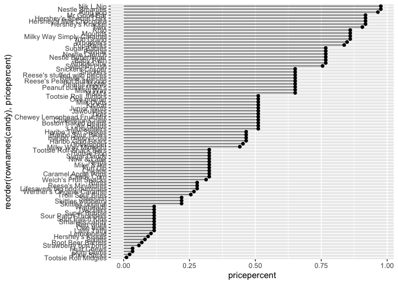

# class 10 Halloween Mini-Project
Trinity Lee A16639698

Exploratory Analysis of Halloween Candy In this mini-project, we will
explore FiveThirtyEight’s Halloween Candy dataset.

\##1. Importing candy data First things first, let’s get the data from
the FiveThirtyEight GitHub repo.

``` r
candy_file <- "candy-data.csv"

candy = read.csv(candy_file, row.names=1)
head(candy)
```

                 chocolate fruity caramel peanutyalmondy nougat crispedricewafer
    100 Grand            1      0       1              0      0                1
    3 Musketeers         1      0       0              0      1                0
    One dime             0      0       0              0      0                0
    One quarter          0      0       0              0      0                0
    Air Heads            0      1       0              0      0                0
    Almond Joy           1      0       0              1      0                0
                 hard bar pluribus sugarpercent pricepercent winpercent
    100 Grand       0   1        0        0.732        0.860   66.97173
    3 Musketeers    0   1        0        0.604        0.511   67.60294
    One dime        0   0        0        0.011        0.116   32.26109
    One quarter     0   0        0        0.011        0.511   46.11650
    Air Heads       0   0        0        0.906        0.511   52.34146
    Almond Joy      0   1        0        0.465        0.767   50.34755

Q1. How many different candy types are in this dataset?

``` r
candy_types<-nrow(candy)
candy_types
```

    [1] 85

Q2. How many fruity candy types are in the dataset?

``` r
fruity_candy<-sum(candy$fruity)
fruity_candy
```

    [1] 38

\##2. What is your favorate candy?

One of the most interesting variables in the dataset is `winpercent`.
For a given candy this value is the percentage of people who prefer this
candy over another randomly chosen candy from the dataset. Higher values
indicate a more popular candy.

We can find the `winpercent` value for Twix by using its name to access
the corresponding row of the dataset.

``` r
candy["Twix", ]$winpercent
```

    [1] 81.64291

Q3. What is your favorite candy in the dataset and what is it’s
winpercent value?

``` r
candy["Pixie Sticks", ]$winpercent
```

    [1] 37.72234

Q4. What is the winpercent value for “Kit Kat”?

``` r
candy["Kit Kat", ]$winpercent
```

    [1] 76.7686

Q5. What is the winpercent value for “Tootsie Roll Snack Bars”?

``` r
candy["Tootsie Roll Snack Bars", ]$winpercent
```

    [1] 49.6535

There is a useful `skim()` function in the skimr package that can help
give you a quick overview of a given dataset. Let’s install this package
and try it on our candy data.

``` r
library("skimr")
skim(candy)
```

|                                                  |       |
|:-------------------------------------------------|:------|
| Name                                             | candy |
| Number of rows                                   | 85    |
| Number of columns                                | 12    |
| \_\_\_\_\_\_\_\_\_\_\_\_\_\_\_\_\_\_\_\_\_\_\_   |       |
| Column type frequency:                           |       |
| numeric                                          | 12    |
| \_\_\_\_\_\_\_\_\_\_\_\_\_\_\_\_\_\_\_\_\_\_\_\_ |       |
| Group variables                                  | None  |

Data summary

**Variable type: numeric**

| skim_variable    | n_missing | complete_rate |  mean |    sd |    p0 |   p25 |   p50 |   p75 |  p100 | hist  |
|:-----------------|----------:|--------------:|------:|------:|------:|------:|------:|------:|------:|:------|
| chocolate        |         0 |             1 |  0.44 |  0.50 |  0.00 |  0.00 |  0.00 |  1.00 |  1.00 | ▇▁▁▁▆ |
| fruity           |         0 |             1 |  0.45 |  0.50 |  0.00 |  0.00 |  0.00 |  1.00 |  1.00 | ▇▁▁▁▆ |
| caramel          |         0 |             1 |  0.16 |  0.37 |  0.00 |  0.00 |  0.00 |  0.00 |  1.00 | ▇▁▁▁▂ |
| peanutyalmondy   |         0 |             1 |  0.16 |  0.37 |  0.00 |  0.00 |  0.00 |  0.00 |  1.00 | ▇▁▁▁▂ |
| nougat           |         0 |             1 |  0.08 |  0.28 |  0.00 |  0.00 |  0.00 |  0.00 |  1.00 | ▇▁▁▁▁ |
| crispedricewafer |         0 |             1 |  0.08 |  0.28 |  0.00 |  0.00 |  0.00 |  0.00 |  1.00 | ▇▁▁▁▁ |
| hard             |         0 |             1 |  0.18 |  0.38 |  0.00 |  0.00 |  0.00 |  0.00 |  1.00 | ▇▁▁▁▂ |
| bar              |         0 |             1 |  0.25 |  0.43 |  0.00 |  0.00 |  0.00 |  0.00 |  1.00 | ▇▁▁▁▂ |
| pluribus         |         0 |             1 |  0.52 |  0.50 |  0.00 |  0.00 |  1.00 |  1.00 |  1.00 | ▇▁▁▁▇ |
| sugarpercent     |         0 |             1 |  0.48 |  0.28 |  0.01 |  0.22 |  0.47 |  0.73 |  0.99 | ▇▇▇▇▆ |
| pricepercent     |         0 |             1 |  0.47 |  0.29 |  0.01 |  0.26 |  0.47 |  0.65 |  0.98 | ▇▇▇▇▆ |
| winpercent       |         0 |             1 | 50.32 | 14.71 | 22.45 | 39.14 | 47.83 | 59.86 | 84.18 | ▃▇▆▅▂ |

Q6. Is there any variable/column that looks to be on a different scale
to the majority of the other columns in the dataset?

winpercent

Q7. What do you think a zero and one represent for the candy\$chocolate
column?

Candy types are 1 if the candy is that type and 0 if it is not. So a
zero for the candy\$chocolate column would mean that that candy is not
chocolate and a one would mean that it is chocolate.

A good place to start any exploratory analysis is with a histogram. You
can do this most easily with the base R function `hist()`.
Alternatively, you can use `ggplot()` with `geom_hist()`.

Q8. Plot a histogram of winpercent values

``` r
hist(candy$winpercent)
```


Q9. Is the distribution of winpercent values symmetrical? The
distribution of winpercent values is not symmetrical it is skewed right.

Q10. Is the center of the distribution above or below 50%? The center is
below 50%

Q11. On average is chocolate candy higher or lower ranked than fruit
candy?

``` r
candy$winpercent[as.logical(candy$chocolate)]
```

     [1] 66.97173 67.60294 50.34755 56.91455 38.97504 55.37545 62.28448 56.49050
     [9] 59.23612 57.21925 76.76860 71.46505 66.57458 55.06407 73.09956 60.80070
    [17] 64.35334 47.82975 54.52645 70.73564 66.47068 69.48379 81.86626 84.18029
    [25] 73.43499 72.88790 65.71629 34.72200 37.88719 76.67378 59.52925 48.98265
    [33] 43.06890 45.73675 49.65350 81.64291 49.52411

``` r
mean(candy$winpercent[as.logical(candy$chocolate)])
```

    [1] 60.92153

``` r
candy$winpercent[as.logical(candy$fruity)]
```

     [1] 52.34146 34.51768 36.01763 24.52499 42.27208 39.46056 43.08892 39.18550
     [9] 46.78335 57.11974 51.41243 42.17877 28.12744 41.38956 39.14106 52.91139
    [17] 46.41172 55.35405 22.44534 39.44680 41.26551 37.34852 35.29076 42.84914
    [25] 63.08514 55.10370 45.99583 59.86400 52.82595 67.03763 34.57899 27.30386
    [33] 54.86111 48.98265 47.17323 45.46628 39.01190 44.37552

``` r
mean(candy$winpercent[as.logical(candy$fruity)])
```

    [1] 44.11974

``` r
t.test(candy$winpercent[as.logical(candy$fruity)],candy$winpercent[as.logical(candy$chocolate)])
```


        Welch Two Sample t-test

    data:  candy$winpercent[as.logical(candy$fruity)] and candy$winpercent[as.logical(candy$chocolate)]
    t = -6.2582, df = 68.882, p-value = 2.871e-08
    alternative hypothesis: true difference in means is not equal to 0
    95 percent confidence interval:
     -22.15795 -11.44563
    sample estimates:
    mean of x mean of y 
     44.11974  60.92153 

chocolate candy is ranked higher

Q12. Is this difference statistically significant?

The difference is statistically significant since the p-value is small
(\>0.5)

\##3. Overall Candy Rankings

Let’s use the base R `order()` function together with `head()` to sort
the whole dataset by `winpercent`

``` r
head(candy[order(candy$winpercent),], n=5)
```

                       chocolate fruity caramel peanutyalmondy nougat
    Nik L Nip                  0      1       0              0      0
    Boston Baked Beans         0      0       0              1      0
    Chiclets                   0      1       0              0      0
    Super Bubble               0      1       0              0      0
    Jawbusters                 0      1       0              0      0
                       crispedricewafer hard bar pluribus sugarpercent pricepercent
    Nik L Nip                         0    0   0        1        0.197        0.976
    Boston Baked Beans                0    0   0        1        0.313        0.511
    Chiclets                          0    0   0        1        0.046        0.325
    Super Bubble                      0    0   0        0        0.162        0.116
    Jawbusters                        0    1   0        1        0.093        0.511
                       winpercent
    Nik L Nip            22.44534
    Boston Baked Beans   23.41782
    Chiclets             24.52499
    Super Bubble         27.30386
    Jawbusters           28.12744

Q13. What are the five least liked candy types in this set?

Nik L Nip, Boston Baked Beans, Chiclets, Super Bubble, Jawbusters

Q14. What are the top 5 all time favorite candy types out of this set?

``` r
tail(candy[order(candy$winpercent),], n=5)
```

                              chocolate fruity caramel peanutyalmondy nougat
    Snickers                          1      0       1              1      1
    Kit Kat                           1      0       0              0      0
    Twix                              1      0       1              0      0
    Reese's Miniatures                1      0       0              1      0
    Reese's Peanut Butter cup         1      0       0              1      0
                              crispedricewafer hard bar pluribus sugarpercent
    Snickers                                 0    0   1        0        0.546
    Kit Kat                                  1    0   1        0        0.313
    Twix                                     1    0   1        0        0.546
    Reese's Miniatures                       0    0   0        0        0.034
    Reese's Peanut Butter cup                0    0   0        0        0.720
                              pricepercent winpercent
    Snickers                         0.651   76.67378
    Kit Kat                          0.511   76.76860
    Twix                             0.906   81.64291
    Reese's Miniatures               0.279   81.86626
    Reese's Peanut Butter cup        0.651   84.18029

Snickers, Kit Kat, Twix, Reese’s Miniatures, Reese’s Peanut Butter cup

To examine more of the dataset in this vain we can make a barplot to
visualize the overall rankings. We will use an iterative approach to
building a useful visulization by getting a rough starting plot and then
refining and adding useful details in a stepwise process.

Q15. Make a first barplot of candy ranking based on winpercent values.

``` r
library(ggplot2)
ggplot(candy) + 
  aes(winpercent, rownames(candy)) +
  geom_col()
```


Q16. This is quite ugly, use the reorder() function to get the bars
sorted by winpercent?

``` r
ggplot(candy) + 
  aes(winpercent, reorder(rownames(candy),winpercent)) +
  geom_col()
```


\##Time to add some useful color et’s setup a color vector (that
signifies candy type) that we can then use for some future plots. We
start by making a vector of all black values (one for each candy). Then
we overwrite chocolate (for chocolate candy), brown (for candy bars) and
red (for fruity candy) values.

``` r
my_cols=rep("black", nrow(candy))
my_cols[as.logical(candy$chocolate)] = "chocolate"
my_cols[as.logical(candy$bar)] = "brown"
my_cols[as.logical(candy$fruity)] = "pink"
ggplot(candy) + 
  aes(winpercent, reorder(rownames(candy),winpercent)) +
  geom_col(fill=my_cols) 
```


- Q17. What is the worst ranked chocolate candy? sixlets
- Q18. What is the best ranked fruity candy? starburst

\##4. Taking a look at pricepercent What about value for money? What is
the the best candy for the least money? One way to get at this would be
to make a plot of `winpercent` vs the `pricepercent` variable. The
`pricepercent` variable records the percentile rank of the candy’s price
against all the other candies in the dataset. Lower vales are less
expensive and high values more expensive.

To this plot we will add text labels so we can more easily identify a
given candy. There is a regular `geom_label()` However, as there are
quite a few candys in our dataset lots of these labels will be
overlapping and hard to read. To help with this we can use the
`geom_text_repel()` function from the `ggrepel` package

``` r
library(ggrepel)

# How about a plot of price vs win
ggplot(candy) +
  aes(winpercent, pricepercent, label=rownames(candy)) +
  geom_point(col=my_cols) + 
  geom_text_repel(col=my_cols, size=3.3, max.overlaps = 5)
```

    Warning: ggrepel: 50 unlabeled data points (too many overlaps). Consider
    increasing max.overlaps


Q19. Which candy type is the highest ranked in terms of winpercent for
the least money - i.e. offers the most bang for your buck? Reese’s
miniatures

Q20. What are the top 5 most expensive candy types in the dataset and of
these which is the least popular?

``` r
ord <- order(candy$pricepercent, decreasing = TRUE)
head( candy[ord,c(11,12)], n=5 )
```

                             pricepercent winpercent
    Nik L Nip                       0.976   22.44534
    Nestle Smarties                 0.976   37.88719
    Ring pop                        0.965   35.29076
    Hershey's Krackel               0.918   62.28448
    Hershey's Milk Chocolate        0.918   56.49050

Nik L Nip is the least popular of these (lowest winpercent)

Q21. Make a barplot again with geom_col() this time using pricepercent
and then improve this step by step, first ordering the x-axis by value
and finally making a so called “dot chat” or “lollipop” chart by
swapping geom_col() for geom_point() + geom_segment().

``` r
ggplot(candy) + 
  aes(pricepercent, reorder(rownames(candy),pricepercent)) +
  geom_col()
```


``` r
# Make a lollipop chart of pricepercent
ggplot(candy) +
  aes(pricepercent, reorder(rownames(candy), pricepercent)) +
  geom_segment(aes(yend = reorder(rownames(candy), pricepercent), 
                   xend = 0), col="gray40") +
    geom_point()
```



\##5 Exploring the correlation structure

Now that we’ve explored the dataset a little, we’ll see how the
variables interact with one another. We’ll use correlation and view the
results with the `corrplot` package to plot a correlation matrix.

``` r
library(corrplot)
```

    corrplot 0.92 loaded

``` r
cij <- cor(candy)
corrplot(cij)
```


Q22. Examining this plot what two variables are anti-correlated
(i.e. have minus values)? Chocolate and fruity Q23. Similarly, what two
variables are most positively correlated? Winpercent and chocolate are
the most positively correlated disregarding the variables compared with
themselves

\##6. Principal Component Analysis

``` r
pca <- prcomp(candy, scale=FALSE)
summary(pca)
```

    Importance of components:
                               PC1     PC2     PC3     PC4     PC5     PC6     PC7
    Standard deviation     14.7231 0.70241 0.47762 0.37292 0.34641 0.33614 0.30748
    Proportion of Variance  0.9935 0.00226 0.00105 0.00064 0.00055 0.00052 0.00043
    Cumulative Proportion   0.9935 0.99574 0.99678 0.99742 0.99797 0.99849 0.99892
                               PC8     PC9    PC10    PC11    PC12
    Standard deviation     0.27417 0.23826 0.21435 0.18434 0.15331
    Proportion of Variance 0.00034 0.00026 0.00021 0.00016 0.00011
    Cumulative Proportion  0.99927 0.99953 0.99974 0.99989 1.00000

Now we can plot our main PCA score plot of PC1 vs PC2.

``` r
plot(pca$x[,1:2])
```


We can change the plotting character and add some color:

``` r
plot(pca$x[,1:2], col=my_cols, pch=16)
```


We can make a much nicer plot with the `ggplot2` package but it is
important to note that ggplot works best when you supply an input
data.frame that includes a separate column for each of the aesthetics
you would like displayed in your final plot. To accomplish this we make
a new data.frame here that contains our PCA results with all the rest of
our candy data.

``` r
# Make a new data-frame with our PCA results and candy data
my_data <- cbind(candy, pca$x[,1:3])
z <- ggplot(my_data) + 
        aes(x=PC1, y=PC2, 
            size=winpercent/100,  
            text=rownames(my_data),
            label=rownames(my_data)) +
        geom_point(col=my_cols)

z
```


we can use the `ggrepel` package and the
`function ggrepel::geom_text_repel()` to label up the plot with non
overlapping candy names like

``` r
library(ggrepel)

z + geom_text_repel(size=3.3, col=my_cols, max.overlaps = 7)  + 
  theme(legend.position = "none") +
  labs(title="Halloween Candy PCA",
       subtitle="Colored by type: chocolate bar (dark brown), chocolate other (light brown), fruity (red), other (black)",
       caption="Data from 538 data set")
```

    Warning: ggrepel: 33 unlabeled data points (too many overlaps). Consider
    increasing max.overlaps


more candy labels you can change the max.overlaps value to allow more
overlapping labels or pass the ggplot object z to `plotly` like so to
generate an interactive plot that you can mouse over to see labels:

``` r
library(plotly)
```


    Attaching package: 'plotly'

    The following object is masked from 'package:ggplot2':

        last_plot

    The following object is masked from 'package:stats':

        filter

    The following object is masked from 'package:graphics':

        layout

``` r
#ggplotly(z)
```

Let’s finish by taking a quick look at PCA our loadings.

``` r
par(mar=c(8,4,2,2))
barplot(pca$rotation[,1], las=2, ylab="PC1 Contribution")
```


Q24. What original variables are picked up strongly by PC1 in the
positive direction? Do these make sense to you?

Fruity, hard, and pluribus are picked up strongly by PC1 in the positive
direction which makes sense because most fruity candies are in multiples
and are hard - all characteristics of fruity candies.
